# Προσωπικό & ΕΡΓΑΝΗ στο ekdosi — Οδηγός χρήσης

> Εργαζόμενοι · Άδειες · Ημερολόγιο · Υπερωρίες · Ψηφιακή κάρτα εργασίας · Σύνδεση με το ΕΡΓΑΝΗ ΙΙ · «Το ημερολόγιό μου»
>
> Έκδοση οδηγού: Σεπτέμβριος 2026 (ekdosi v2.7+)
>
> Οι εικόνες είναι από εικονική εταιρεία («Demo Υπηρεσίες ΟΕ») — ονόματα, ΑΦΜ και πρωτόκολλα είναι φανταστικά.

---

## Περιεχόμενα

1. [Τι κάνει το «Προσωπικό»](#1-τι-κάνει-το-προσωπικό)
2. [Ρόλοι — ποιος βλέπει τι](#2-ρόλοι--ποιος-βλέπει-τι)
3. [Πρώτη ρύθμιση («Ξεκίνημα Προσωπικού»)](#3-πρώτη-ρύθμιση-ξεκίνημα-προσωπικού)
4. [Εργαζόμενοι](#4-εργαζόμενοι)
5. [Άδειες](#5-άδειες)
6. [Ημερολόγιο αδειών & «Η ομάδα σήμερα»](#6-ημερολόγιο-αδειών--η-ομάδα-σήμερα)
7. [Υπερωρίες](#7-υπερωρίες)
8. [Ψηφιακή κάρτα εργασίας & tablet «ρολόι»](#8-ψηφιακή-κάρτα-εργασίας--tablet-ρολόι)
9. [Η κάρτα «ΕΡΓΑΝΗ» στον Πίνακα ελέγχου & οι «φύλακες»](#9-η-κάρτα-εργανη-στον-πίνακα-ελέγχου--οι-φύλακες)
10. [Ιστορικό ΕΡΓΑΝΗ & επίσημο PDF](#10-ιστορικό-εργανη--επίσημο-pdf)
11. [Πέρασμα σε Παραγωγή](#11-πέρασμα-σε-παραγωγή)
12. [«Το ημερολόγιό μου» στο κινητό / Thunderbird / Google](#12-το-ημερολόγιό-μου-στο-κινητό--thunderbird--google)
13. [Καταστάσεις ΕΡΓΑΝΗ — τι σημαίνουν και τι κάνω](#13-καταστάσεις-εργανη--τι-σημαίνουν-και-τι-κάνω)
14. [Συχνές ερωτήσεις](#14-συχνές-ερωτήσεις)
15. [Ιδιωτικότητα & ασφάλεια](#15-ιδιωτικότητα--ασφάλεια)

---

## 1. Τι κάνει το «Προσωπικό»

Το μενού **Προσωπικό** συγκεντρώνει ό,τι αφορά τους εργαζόμενους της εταιρείας και τη σχέση τους με το **ΕΡΓΑΝΗ ΙΙ**:

| Λειτουργία | Τι κάνει | ΕΡΓΑΝΗ |
|---|---|---|
| **Εργαζόμενοι** | Μητρώο εργαζομένων, εισαγωγή από το ΕΡΓΑΝΗ, σύνδεση με λογαριασμούς ekdosi | Ανάγνωση δυναμικού |
| **Άδειες** | Αίτηση → έγκριση → email στον λογιστή → (προαιρετικά) αυτόματη δήλωση | `WTOLeave` + ανάκληση |
| **Ημερολόγιο αδειών** | Μηνιαία εικόνα: ποιος λείπει, αργίες, υπερωρίες | — |
| **Υπερωρίες** | Δήλωση υπερωρίας **πριν** ξεκινήσει | `WTOOv` |
| **Χτύπημα κάρτας / Κινήσεις κάρτας / Σημείο κάρτας (QR)** | Ψηφιακή κάρτα εργασίας από κινητό ή tablet γραφείου | `WRKCardSE` |
| **Ιστορικό ΕΡΓΑΝΗ** | Κάθε κλήση στο ΕΡΓΑΝΗ με πρωτόκολλο και επίσημο PDF | — |
| **Τοπικές αργίες** | Αργίες της πόλης/εταιρείας (πέρα από τις εθνικές) | — |

**Βασική αρχή:** τίποτα δεν δηλώνεται στο ΕΡΓΑΝΗ «κρυφά». Κάθε αυτόματη δήλωση ενεργοποιείται ρητά (ανά είδος) από τον διαχειριστή, και μέχρι το [Πέρασμα σε Παραγωγή](#11-πέρασμα-σε-παραγωγή) όλα πάνε στο **δοκιμαστικό** ΕΡΓΑΝΗ (χωρίς νομική ισχύ) — ο λογιστής συνεχίζει να δηλώνει κανονικά.

---

## 2. Ρόλοι — ποιος βλέπει τι

| Ρόλος | Τι μπορεί |
|---|---|
| **Διαχειριστής εταιρείας** (company admin) | Τα πάντα στο Προσωπικό: εργαζόμενοι, έγκριση/απόρριψη/ανάκληση αδειών, υπερωρίες, κινήσεις κάρτας, σημείο κάρτας, ιστορικό ΕΡΓΑΝΗ, ρυθμίσεις. |
| **Operator** (χειριστής) | Ζητά τις δικές του άδειες, βλέπει το ημερολόγιο (οι άδειες των άλλων ως «•», χωρίς είδος), χτυπά κάρτα αν είναι εργαζόμενος. |
| **Προσωπικό (άδειες & κάρτα)** | Για εργαζόμενους που **δεν** χρειάζονται τιμολόγηση: βλέπουν μόνο τις άδειες τους, το ημερολόγιο και το «Χτύπημα κάρτας». Τίποτα άλλο από το ekdosi. |
| **Super admin** | Επιπλέον: καρτέλα **ΕΡΓΑΝΗ** της εταιρείας (κωδικοί, διακόπτες, Πέρασμα σε Παραγωγή), χρονοπρογραμματισμός. |

> Ο ρόλος δίνεται από **Διαχείριση → Χρήστες → Ρόλος**. Ένας εργαζόμενος χωρίς λογαριασμό μπορεί να υπάρχει κανονικά: τις άδειές του τις καταχωρεί ο διαχειριστής και χτυπά κάρτα μόνο από το tablet.

---

## 3. Πρώτη ρύθμιση («Ξεκίνημα Προσωπικού»)

Στη σελίδα **Προσωπικό → Εργαζόμενοι** υπάρχει η λίστα **«Ξεκίνημα Προσωπικού»**: δείχνει τι λείπει ακόμη, με ✓ ό,τι ολοκληρώθηκε. Όταν ολοκληρωθούν όλα μένει διπλωμένη ως «✓ όλα έτοιμα».

**Βήμα προς βήμα:**

1. **Ενεργοποίηση του πυλώνα** *(super admin)* — **Διαχείριση → Εταιρείες → (εταιρεία) → καρτέλα «ΕΡΓΑΝΗ»** → «Ενεργό Προσωπικό».
2. **Κωδικοί e-ΕΦΚΑ** του εργοδότη στην ίδια καρτέλα → **«Test σύνδεσης»**. Πρέπει να δείξει την επωνυμία και τον ΑΦΜ της εταιρείας (και αν είναι «υπόχρεη κάρτας»). Οι κωδικοί είναι **ίδιοι** για δοκιμαστικό και παραγωγή.
3. **Email λογιστή** — **Ρυθμίσεις εταιρείας → «Προσωπικό — ΕΡΓΑΝΗ»**. Εκεί πηγαίνει κάθε εγκεκριμένη/ανακληθείσα άδεια και κάθε υπερωρία.
4. **Εργαζόμενοι** — **«Εισαγωγή από ΕΡΓΑΝΗ»** (βλ. §4) ή «Νέος εργαζόμενος» με το χέρι.
5. **Λογαριασμοί** *(προαιρετικό)* — σύνδεση κάθε εργαζομένου με τον λογαριασμό του στο ekdosi, για να ζητά μόνος του άδειες.
6. *(Μόνο αν χρησιμοποιείτε κάρτα)* **PIN** στους εργαζόμενους και **tablet γραφείου** (§8).

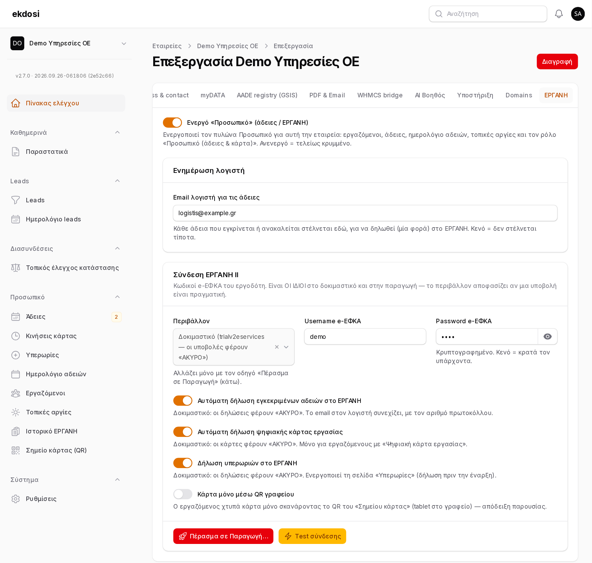
*Εταιρεία → καρτέλα «ΕΡΓΑΝΗ»: σύνδεση, Test σύνδεσης, επιλογές δήλωσης και «Πέρασμα σε Παραγωγή…»*

---

## 4. Εργαζόμενοι

**Προσωπικό → Εργαζόμενοι**

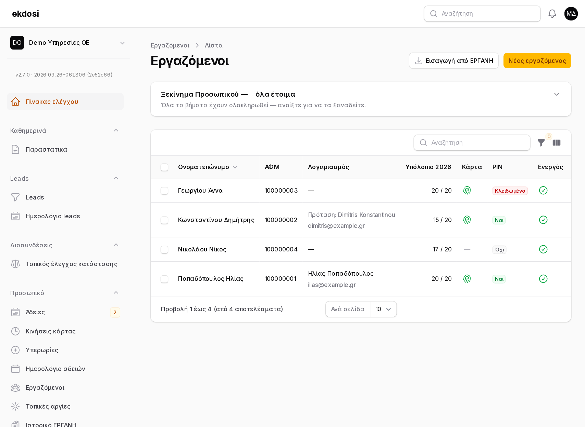
*Εργαζόμενοι: «Ξεκίνημα Προσωπικού», λογαριασμός/πρόταση σύνδεσης, κατάσταση PIN*

### Εισαγωγή από ΕΡΓΑΝΗ

Το κουμπί **«Εισαγωγή από ΕΡΓΑΝΗ»** (πάνω δεξιά) διαβάζει το **τρέχον δυναμικό** της εταιρείας από το ΕΡΓΑΝΗ (Παραγωγή — **μόνο ανάγνωση**, δεν δηλώνεται τίποτα) και δείχνει:

- **Νέος — θα προστεθεί** (τσεκαρισμένοι από προεπιλογή),
- **Υπάρχει ως «…»** — ενημερώνεται μόνο το παράρτημα και η ημ. πρόσληψης (αν έλειπε), **το όνομα δεν αλλάζει**,
- **Υπάρχει στους διαγραμμένους** — δεν αλλάζει (επαναφορά με το χέρι),
- **Ενεργοί εδώ αλλά όχι στο ΕΡΓΑΝΗ** — μόνο ενημέρωση.

Κρατάμε **μόνο** ΑΦΜ, ονοματεπώνυμο, παράρτημα και ημ. πρόσληψης. Το ΕΡΓΑΝΗ στέλνει και ΑΜΚΑ, ταυτότητα, διεύθυνση, αποδοχές — **δεν αποθηκεύονται ποτέ**. Κανείς δεν διαγράφεται.

> Τα ονόματα από το ΕΡΓΑΝΗ έρχονται χωρίς τόνους (π.χ. «Αντιβαλιδης Ηλιας») — διορθώνονται ελεύθερα στην καρτέλα· η δήλωση στο ΕΡΓΑΝΗ τα γράφει πάντα κεφαλαία χωρίς τόνους.

### Η καρτέλα εργαζομένου

| Πεδίο | Σημασία |
|---|---|
| **ΑΦΜ** | Όπως στο ΕΡΓΑΝΗ. **Υποχρεωτικός** για ψηφιακή κάρτα. |
| **Ημέρες κανονικής άδειας / έτος** | Για το υπόλοιπο (π.χ. 20 τον 1ο χρόνο στο πενθήμερο — επιβεβαιώστε με τον λογιστή). |
| **Λογαριασμός στο ekdosi** | Για να ζητά μόνος του άδειες / να χτυπά κάρτα από το κινητό. |
| **Ψηφιακή κάρτα εργασίας** | Μόνο αν ο λογιστής τον έχει δηλώσει στο ΕΡΓΑΝΗ «με ένδειξη κάρτας». |
| **PIN ρολογιού (tablet)** | 4–6 ψηφία για το tablet του γραφείου. Αποθηκεύεται κρυπτογραφημένο· κενό = το κρατά. |
| **Α/Α παραρτήματος ΕΡΓΑΝΗ** | 0 = η έδρα. |
| **Ενεργός** | Όποιος αποχωρεί γίνεται «Ενεργός: όχι» — **όχι διαγραφή**, για να μένει το ιστορικό. |

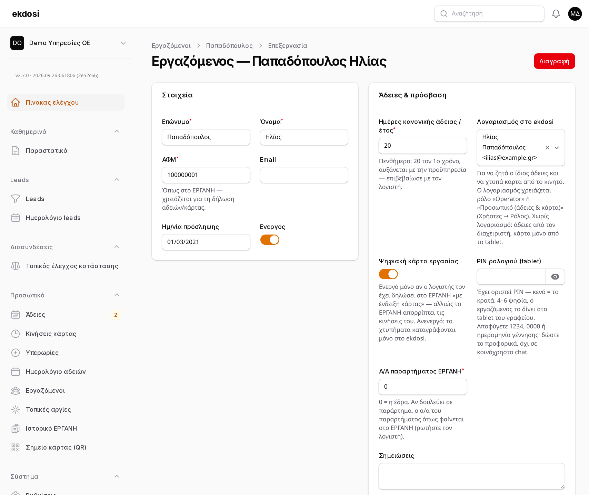
*Η καρτέλα εργαζομένου*

### Σύνδεση με λογαριασμούς

Στη στήλη **«Λογαριασμός»** φαίνεται ο συνδεδεμένος χρήστης (όνομα + email). Αν δεν υπάρχει, το ekdosi προτείνει: **«Πρόταση: Ilias Antivalidis»** — ταιριάζει με ίδιο email ή ίδιο ονοματεπώνυμο (και **ελληνικά ↔ greeklish**), μόνο όταν υπάρχει **ένα** πιθανό ταίριασμα. Πατήστε **«Σύνδεση»** για επιβεβαίωση, ή επιλέξτε πολλούς και **«Σύνδεση με τις προτάσεις»**.

Αν ο λογαριασμός δεν έχει ρόλο που επιτρέπει άδειες, εμφανίζεται **«⚠ χωρίς ρόλο για άδειες»**.

### PIN & κλείδωμα

Μετά από 5 λάθος PIN στο tablet το PIN **κλειδώνει** (15', 30', 1 ώρα… έως 24 ώρες). Η στήλη **PIN** δείχνει «Κλειδωμένο» και εμφανίζεται το κουμπί **«Ξεκλείδωμα PIN»** — πατήστε το μόνο αν το ζήτησε ο εργαζόμενος. Νέο PIN ξεκλειδώνει αυτόματα.

---

## 5. Άδειες

**Προσωπικό → Άδειες**

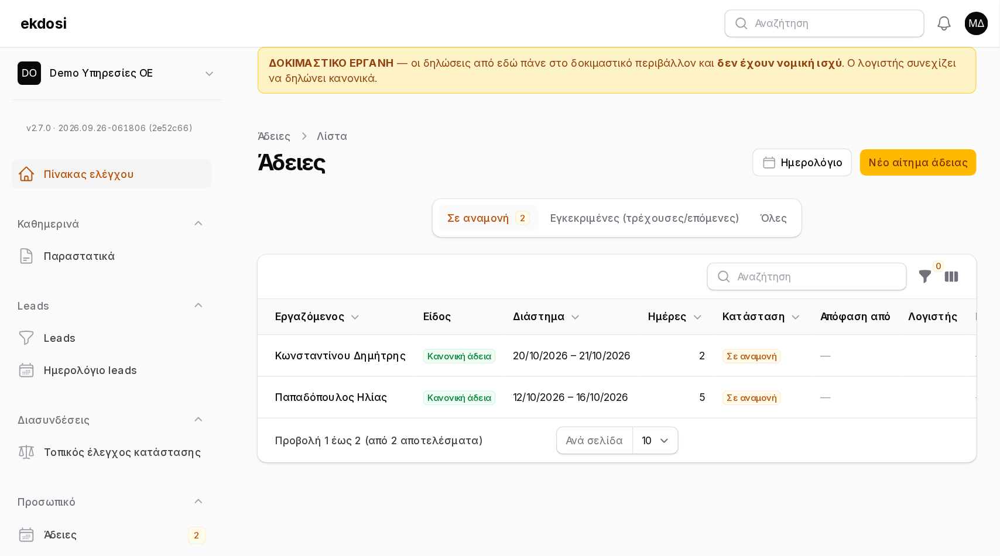
*Άδειες: καρτέλες «Σε αναμονή / Εγκεκριμένες / Όλες» και η μπάρα «ΔΟΚΙΜΑΣΤΙΚΟ ΕΡΓΑΝΗ»*

### Αίτηση άδειας

**«Νέο αίτημα άδειας»** → είδος, **Από / Έως (και)**. Οι **εργάσιμες ημέρες** υπολογίζονται αυτόματα (χωρίς Σαββατοκύριακα, εθνικές και τοπικές αργίες).

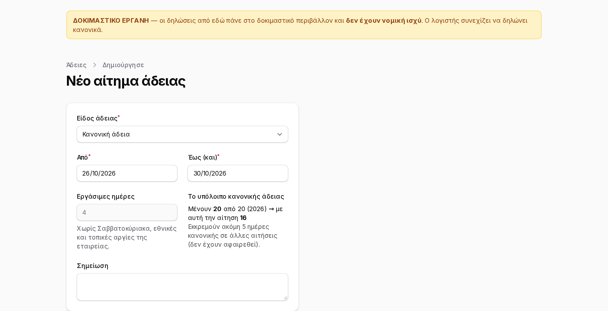
*Νέο αίτημα: οι εργάσιμες ημέρες βγαίνουν αυτόματα (εδώ 4 — η 28η Οκτωβρίου είναι αργία) και φαίνεται το υπόλοιπο πριν → μετά*

Δίπλα φαίνεται **«Το υπόλοιπο κανονικής άδειας»**:

> Μένουν **10** από 20 (2026) → με αυτή την αίτηση **7**

- Αν η αίτηση **ξεπερνά** το υπόλοιπο, εμφανίζεται ⚠ — **δεν μπλοκάρεται**, αποφασίζει ο εγκρίνων.
- Αν η άδεια περνά την Πρωτοχρονιά (π.χ. 29/12–5/1), το υπόλοιπο φαίνεται **ανά έτος** — οι ημέρες μοιράζονται στα δύο έτη ανάλογα με τις εργάσιμες.
- Αν υπάρχουν άλλες αιτήσεις σε αναμονή, αναφέρονται (δεν έχουν αφαιρεθεί ακόμη).

Ο διαχειριστής μπορεί να καταχωρήσει άδεια για οποιονδήποτε εργαζόμενο και με **«Έγκριση αμέσως»**.

### Έγκριση / απόρριψη

Στην καρτέλα **«Σε αναμονή»** (οι εγκρίνοντες τη βλέπουν πρώτη) κάθε αίτημα έχει **Έγκριση** και **Απόρριψη** κατευθείαν στη γραμμή. Στην έγκριση μπορούν να διορθωθούν οι εργάσιμες ημέρες.

Με την έγκριση:

1. στέλνεται **email στον λογιστή** (και, αν η δήλωση είναι στην Παραγωγή, με το **επίσημο PDF** του ΕΡΓΑΝΗ),
2. αν είναι ενεργή η **αυτόματη δήλωση αδειών**, η άδεια δηλώνεται στο ΕΡΓΑΝΗ (`WTOLeave`) — ανά εργάσιμη ημέρα,
3. ο εργαζόμενος ειδοποιείται (καμπανάκι).

### Ανάκληση

Μια εγκεκριμένη άδεια που ακυρώνεται **ανακαλείται αυτόματα** και στο ΕΡΓΑΝΗ (οι άδειες είναι τα μόνα έντυπα που ανακαλούνται μέσω API) και ο λογιστής ενημερώνεται.

### Δήλωση ΕΡΓΑΝΗ — χειροκίνητα

Στην προβολή μιας άδειας υπάρχουν, ανάλογα με την κατάσταση:

- **«Δήλωση στο ΕΡΓΑΝΗ»** — για άδεια που δεν δηλώθηκε ή απέτυχε,
- **«Καταχώριση πρωτοκόλλου»** — αν τη δήλωσε κάποιος χειροκίνητα στο ΕΡΓΑΝΗ,
- **«PDF ΕΡΓΑΝΗ»** — το επίσημο αποδεικτικό (το βλέπει και ο ίδιος ο εργαζόμενος για τη δική του άδεια),
- **«Ανάκληση στο ΕΡΓΑΝΗ»**.

> ⚠ Αν η προηγούμενη προσπάθεια είναι **«Αβέβαιο»** ή ο λογιστής έχει ήδη ειδοποιηθεί να τη δηλώσει, το ekdosi **ζητά επιβεβαίωση** ότι ελέγξατε στο ΕΡΓΑΝΗ πριν ξαναστείλει — για να μη γίνει διπλή δήλωση.

---

## 6. Ημερολόγιο αδειών & «Η ομάδα σήμερα»

### Ημερολόγιο αδειών

**Προσωπικό → Ημερολόγιο αδειών** — εργαζόμενοι × ημέρες του μήνα.

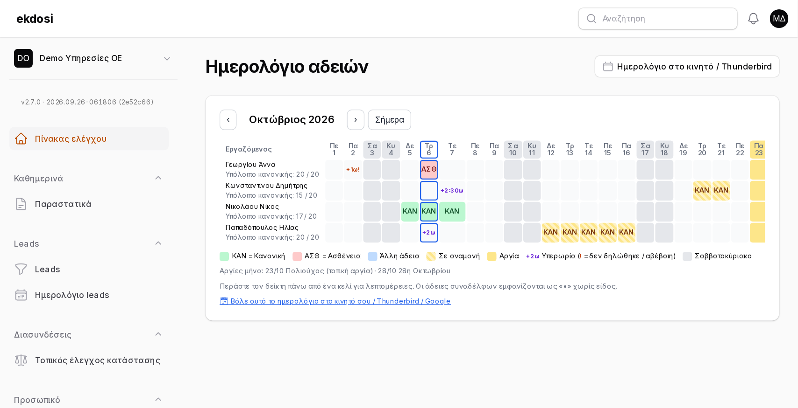
*Ημερολόγιο αδειών: ΚΑΝ/ΑΣΘ, σε αναμονή (ριγέ), αργίες, υπερωρίες «+2ω»*

| Σήμανση | Σημασία |
|---|---|
| **ΚΑΝ**, **ΑΣΘ**, … | Είδος άδειας (μόνο για εγκρίνοντες και για τον ίδιο) |
| **•** | Άδεια συναδέλφου — **χωρίς είδος** (η ασθένεια είναι δεδομένο υγείας) |
| κίτρινο | Αργία |
| αχνό | Σε αναμονή |
| **+2ω** | Υπερωρία (**!** = δεν δηλώθηκε / αβέβαιη) |

Κάτω από κάθε όνομα φαίνεται το **υπόλοιπο κανονικής άδειας**. Στο τέλος: **«📅 Βάλε αυτό το ημερολόγιο στο κινητό σου»** (§12).

### «Η ομάδα σήμερα» (Πίνακας ελέγχου)

- **Λείπουν σήμερα** / **Επόμενες 7 ημέρες** — οι συνάδελφοι βλέπουν *ποιος* λείπει, όχι το είδος.
- **Περιμένουν έγκριση** — αριθμός + link (μόνο εγκρίνοντες).
- **Μέσα τώρα (κάρτα)** — ποιος έχει χτυπήσει είσοδο (μόνο αν χρησιμοποιείται η κάρτα).

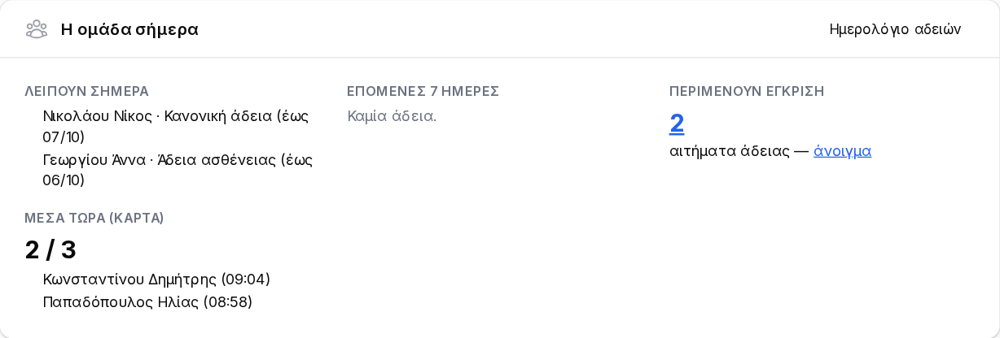
*«Η ομάδα σήμερα» στον Πίνακα ελέγχου*

---

## 7. Υπερωρίες

**Προσωπικό → Υπερωρίες** *(διαχειριστής)*

> Ενεργοποίηση: Εταιρεία → ΕΡΓΑΝΗ → **«Δήλωση υπερωριών στο ΕΡΓΑΝΗ»**. Χωρίς αυτό η σελίδα εξηγεί πώς ενεργοποιείται.

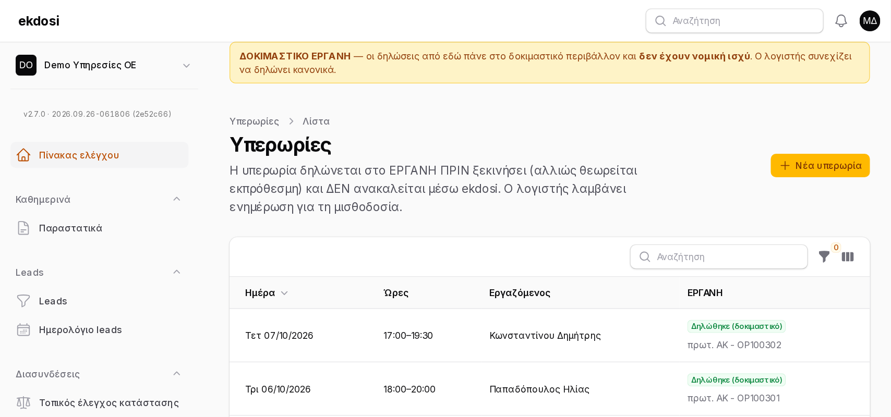
*Υπερωρίες: ημέρα, ώρες, κατάσταση και πρωτόκολλο ΕΡΓΑΝΗ*

**«Νέα υπερωρία»** → εργαζόμενος, ημέρα, **Από / Έως** (ΩΩ:ΛΛ) → **Δήλωση**. Δηλώνεται **αμέσως** στο ΕΡΓΑΝΗ (`WTOOv`).

**Κανόνες που ελέγχει το ekdosi πριν στείλει:**

- δηλώνεται **ΜΟΝΟ πριν ξεκινήσει** — μια υπερωρία που άρχισε το ΕΡΓΑΝΗ την απορρίπτει ως «εκπρόθεσμη»,
- **όχι επικαλύψεις** με άλλη υπερωρία του ίδιου,
- η λήξη μετά την έναρξη την ίδια ημέρα (μετά τα μεσάνυχτα → στο ΕΡΓΑΝΗ χειροκίνητα),
- ο εργαζόμενος χρειάζεται ΑΦΜ.

Μια υπερωρία **δεν ανακαλείται** μέσω API — γι' αυτό δεν επεξεργάζεται ούτε διαγράφεται. Ο λογιστής λαμβάνει email για τη μισθοδοσία. Αν μια αποτυχημένη δήλωση αντικατασταθεί από νέα για τις ίδιες ώρες, η παλιά γίνεται **«Αντικαταστάθηκε»** και δεν ξαναστέλνεται ποτέ.

---

## 8. Ψηφιακή κάρτα εργασίας & tablet «ρολόι»

> Η κάρτα αφορά μόνο εργοδότες/κλάδους που είναι **υπόχρεοι** (το ekdosi το ελέγχει εβδομαδιαία — §9). Ενεργοποίηση: Εταιρεία → ΕΡΓΑΝΗ → **«Αυτόματη δήλωση ψηφιακής κάρτας»** + στην καρτέλα κάθε εργαζομένου **«Ψηφιακή κάρτα εργασίας»**.

### Χτύπημα από το κινητό — «Χτύπημα κάρτας»

Ο εργαζόμενος ανοίγει **Προσωπικό → Χτύπημα κάρτας** και βλέπει **«Είστε ΜΕΣΑ από 09:02»** ή **«Είστε ΕΚΤΟΣ»** και ένα μεγάλο κουμπί **Είσοδος / Έξοδος**. Η ώρα μπαίνει αυτόματα.

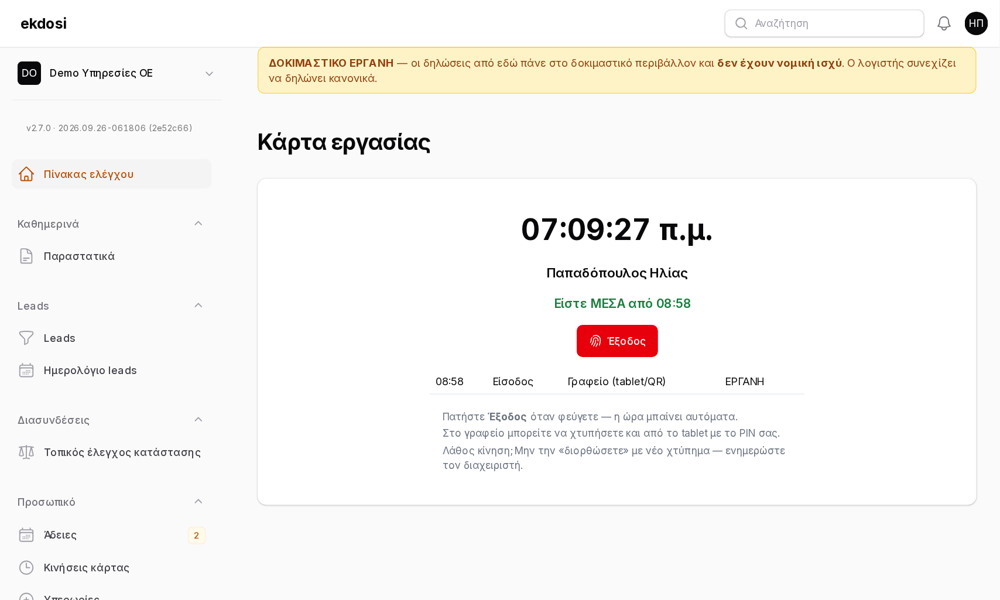
*«Χτύπημα κάρτας» από το κινητό/υπολογιστή του εργαζομένου*

Αν η εταιρεία έχει ορίσει **«Κάρτα μόνο στο γραφείο»** (Ρυθμίσεις εταιρείας), το χτύπημα από κινητό γίνεται μόνο **σκανάροντας το QR του γραφείου** (αλλάζει κάθε λίγα δευτερόλεπτα = απόδειξη παρουσίας).

Λάθος κίνηση; **Μην τη «διορθώσετε» με νέο χτύπημα** — ενημερώστε τον διαχειριστή (η κάρτα δεν ανακαλείται στο ΕΡΓΑΝΗ).

### Tablet «ρολόι» στο γραφείο — χωρίς κινητό, χωρίς login

1. Στο tablet, ένας διαχειριστής συνδέεται **μία φορά** → **Προσωπικό → Σημείο κάρτας (QR)**.
2. **«Ενεργοποίηση αυτής της συσκευής»** → όνομα (π.χ. «Είσοδος γραφείου»). Η σύνδεση του διαχειριστή **κλείνει αυτόματα**.
3. Το tablet μένει στο `https://…/card-kiosk`: **πίνακας παρουσίας** (ποιος είναι μέσα, από πότε) — ο εργαζόμενος πατά το όνομά του → **PIN** → **Καταχώριση**.

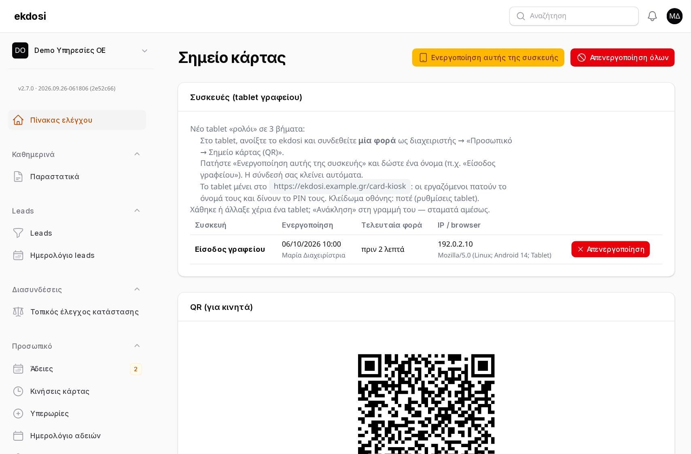
*Σημείο κάρτας: ενεργοποίηση tablet, ενεργές συσκευές, QR για κινητά*

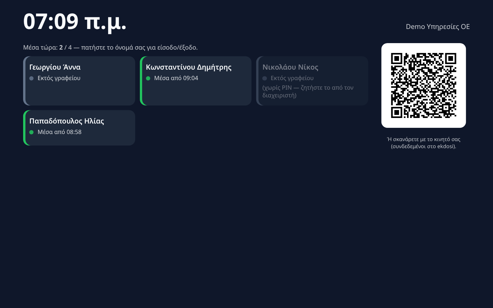
*Το tablet «ρολόι»: ποιος είναι μέσα — πατάτε το όνομα και δίνετε PIN*

Στη σελίδα «Σημείο κάρτας» ο διαχειριστής βλέπει όλες τις συσκευές (τελευταία χρήση, IP) και μπορεί να **ανακαλέσει** μία ή όλες — π.χ. αν χαθεί ένα tablet. Μετά από πολλά λάθος PIN σε λίγα λεπτά το tablet **παγώνει** προσωρινά και οι διαχειριστές ειδοποιούνται.

### Κινήσεις κάρτας

**Προσωπικό → Κινήσεις κάρτας** *(διαχειριστής)*: κάθε χτύπημα, πηγή (Γραφείο tablet/QR, Κινητό/υπολογιστής, Διαχειριστής), κατάσταση ΕΡΓΑΝΗ. Εδώ γίνεται η **«Χειροκίνητη κίνηση»** (ξέχασε το κινητό, διακοπή ρεύματος) και η **επανάληψη** μιας αποτυχημένης δήλωσης· μετά από 15' χρειάζεται **αιτιολογία εκπρόθεσμης υποβολής**.

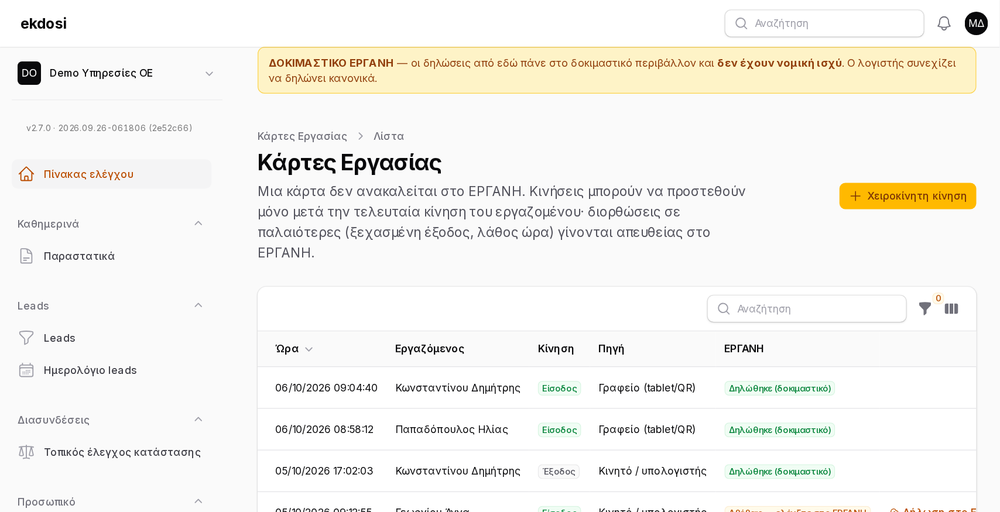
*Κινήσεις κάρτας: πηγή κάθε χτυπήματος και κατάσταση ΕΡΓΑΝΗ*

---

## 9. Η κάρτα «ΕΡΓΑΝΗ» στον Πίνακα ελέγχου & οι «φύλακες»

Στον **Πίνακα ελέγχου** οι διαχειριστές βλέπουν την κάρτα **ΕΡΓΑΝΗ**:

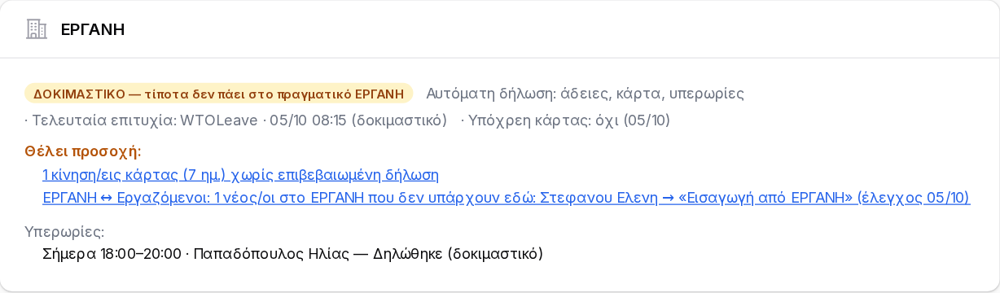
*Η κάρτα «ΕΡΓΑΝΗ»: περιβάλλον, τελευταία επιτυχία, «Θέλει προσοχή» από τους φύλακες, υπερωρίες*

- **Περιβάλλον** — «ΔΟΚΙΜΑΣΤΙΚΟ — τίποτα δεν πάει στο πραγματικό ΕΡΓΑΝΗ» ή «Παραγωγή»,
- **Αυτόματη δήλωση:** άδειες / κάρτα / υπερωρίες,
- **Τελευταία επιτυχία**, **Υπόχρεη κάρτας: ναι/όχι (ημ/νία ελέγχου)**,
- **Θέλει προσοχή** — ό,τι χρειάζεται ενέργεια, με link: αποτυχημένες ή αβέβαιες δηλώσεις, εγκεκριμένη άδεια που ξεκινά έως μεθαύριο χωρίς δήλωση, διαφορές ΕΡΓΑΝΗ ↔ Εργαζόμενοι,
- οι **υπερωρίες** σήμερα/αύριο.

Όσο είστε στο δοκιμαστικό, οι σελίδες που δηλώνουν δείχνουν επίσης την κίτρινη μπάρα **«ΔΟΚΙΜΑΣΤΙΚΟ ΕΡΓΑΝΗ»**.

### Οι «φύλακες» (κάθε Δευτέρα, αυτόματα)

| Φύλακας | Τι ελέγχει | Πότε ειδοποιεί |
|---|---|---|
| **Κάρτας** | Αν η εταιρεία εντάχθηκε στην Ψηφιακή Κάρτα Εργασίας | Την ημέρα που θα γίνει «ναι» |
| **Προσωπικού** | Το δυναμικό του ΕΡΓΑΝΗ σε σχέση με τους «Εργαζόμενους»: νέοι στο ΕΡΓΑΝΗ, ενεργοί εκεί αλλά ανενεργοί εδώ, ενεργοί εδώ αλλά όχι εκεί, με κάρτα χωρίς ΑΦΜ | Μόνο όταν εμφανιστεί **νέα** διαφορά |

Και οι δύο είναι **μόνο ανάγνωση** και **δεν αλλάζουν τίποτα αυτόματα**. Ρυθμίζονται στο **Σύστημα → Χρονοπρογραμματισμός → «ΕΡΓΑΝΗ — εβδομαδιαίος φύλακας»**.

---

## 10. Ιστορικό ΕΡΓΑΝΗ & επίσημο PDF

**Προσωπικό → Ιστορικό ΕΡΓΑΝΗ** *(διαχειριστής)* — κάθε δήλωση, ανάκληση και χειροκίνητη καταχώριση πρωτοκόλλου:

πότε · τι (άδεια / υπερωρία / κάρτα) · εργαζόμενος (link) · περιβάλλον · αποτέλεσμα · πρωτόκολλο · από ποιον.

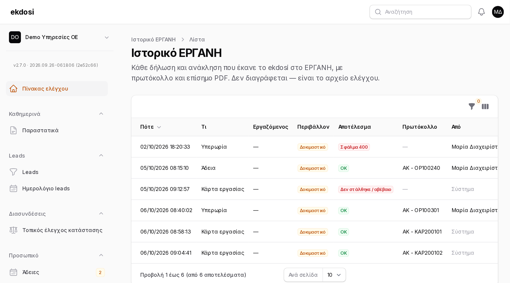
*Ιστορικό ΕΡΓΑΝΗ — το αρχείο ελέγχου κάθε δήλωσης*

- **PDF** — το επίσημο αποδεικτικό του ΕΡΓΑΝΗ (μια ανακληθείσα δήλωση δεν έχει PDF).
- **Λεπτομέρειες** — τι ακριβώς στάλθηκε και τι απάντησε το ΕΡΓΑΝΗ.

Το ιστορικό **δεν επεξεργάζεται και δεν διαγράφεται** — είναι το αρχείο ελέγχου.

---

## 11. Πέρασμα σε Παραγωγή

Μέχρι εδώ όλα τα έντυπα πάνε στο **δοκιμαστικό** ΕΡΓΑΝΗ. Το πέρασμα σε **Παραγωγή** σημαίνει ότι από εκείνη τη στιγμή **το ekdosi δηλώνει πραγματικά** — και **ο λογιστής σταματά να δηλώνει ο ίδιος**.

> ⚠ Ο μεγαλύτερος πρακτικός κίνδυνος είναι η **διπλή δήλωση** (ekdosi + λογιστής από συνήθεια). Μια υπερωρία ή κάρτα **δεν ανακαλείται**.

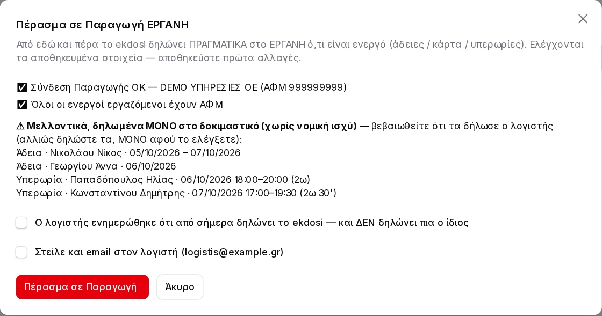
*Ο οδηγός «Πέρασμα σε Παραγωγή»: έλεγχοι, εκκρεμότητες που δηλώθηκαν μόνο στο δοκιμαστικό, επιβεβαίωση λογιστή*

**Εταιρεία → καρτέλα ΕΡΓΑΝΗ → «Πέρασμα σε Παραγωγή…»** *(super admin)*. Το περιβάλλον **δεν αλλάζει από απλό πεδίο** — μόνο από εδώ. Ο οδηγός ελέγχει:

1. ✅ **Σύνδεση Παραγωγής** και ότι ο **ΑΦΜ** του ΕΡΓΑΝΗ ταιριάζει με της εταιρείας,
2. ✅ ότι **όλοι οι ενεργοί εργαζόμενοι έχουν ΑΦΜ**,
3. ⚠ μελλοντικές άδειες/υπερωρίες **δηλωμένες μόνο στο δοκιμαστικό** ή **ποτέ δηλωμένες** — βεβαιωθείτε ότι τις δήλωσε ο λογιστής,
4. ☑ **υποχρεωτικό:** «Ο λογιστής ενημερώθηκε ότι από σήμερα δηλώνει το ekdosi — και ΔΕΝ δηλώνει πια ο ίδιος»,
5. ☐ προαιρετικά **email στον λογιστή** με την ενημέρωση και τις εκκρεμότητες (αν αποτύχει, εμφανίζεται κόκκινη ειδοποίηση).

**Πριν πατήσετε:**

- βάλτε το **πραγματικό email του λογιστή** (Ρυθμίσεις εταιρείας),
- ενεργοποιήστε μόνο τις αυτόματες δηλώσεις που θέλετε (άδειες / υπερωρίες / κάρτα),
- συμφωνήστε με τον λογιστή την **ημερομηνία**.

Υπάρχει **«Επιστροφή σε Δοκιμαστικό»** — τότε ο λογιστής πρέπει να ξαναρχίσει να δηλώνει. Και τα δύο καταγράφονται (ποιος, πότε) στη Δραστηριότητα.

---

## 12. «Το ημερολόγιό μου» στο κινητό / Thunderbird / Google

Κάθε χρήστης έχει ένα **προσωπικό link συνδρομής** (μόνο ανάγνωση) που ενημερώνεται μόνο του (~κάθε ώρα).

**Πού:** κουμπί **«Ημερολόγιο στο κινητό / Thunderbird»** πάνω από το **Ημερολόγιο αδειών** και το **Ημερολόγιο leads** — ή το link **«📅 Βάλε αυτό το ημερολόγιο στο κινητό σου»** κάτω από αυτά.

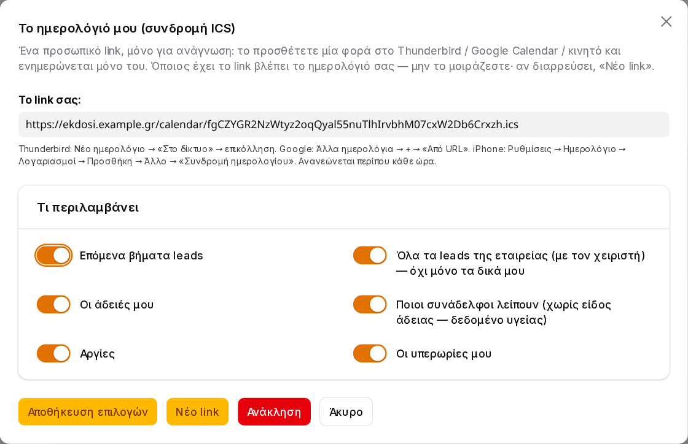
*«Το ημερολόγιό μου»: το προσωπικό link και τι περιλαμβάνει*

**Τι περιλαμβάνει** (επιλέγετε):

| Επιλογή | Περιεχόμενο |
|---|---|
| Επόμενα βήματα leads | Τα δικά σας — ή, με **«Όλα τα leads της εταιρείας»**, όλα με τον χειριστή (προεπιλογή για διαχειριστές) |
| Οι άδειές μου | Με είδος (και οι σε αναμονή) |
| Ποιοι συνάδελφοι λείπουν | «Άδεια — όνομα»· οι εγκρίνοντες βλέπουν και τις σε αναμονή. **Ποτέ το είδος.** |
| Αργίες | Εθνικές + τοπικές |
| Οι υπερωρίες μου | — |

**Προσθήκη:**

- **Thunderbird:** Νέο ημερολόγιο → «Στο δίκτυο» → επικόλληση του link.
- **Google Calendar:** Άλλα ημερολόγια → **+** → «Από URL» (το Google ανανεώνει κάθε λίγες ώρες).
- **iPhone:** Ρυθμίσεις → Ημερολόγιο → Λογαριασμοί → Προσθήκη → Άλλο → «Συνδρομή ημερολογίου».
- **Android:** μέσω Google Calendar.

> 🔒 Όποιος έχει το link βλέπει το ημερολόγιό σας — **μην το μοιράζεστε**. Αν διαρρεύσει: **«Νέο link»** (το παλιό σταματά αμέσως) ή **«Ανάκληση»**.

---

## 13. Καταστάσεις ΕΡΓΑΝΗ — τι σημαίνουν και τι κάνω

| Κατάσταση | Σημαίνει | Τι κάνω |
|---|---|---|
| **Δηλώθηκε** | Το ΕΡΓΑΝΗ το δέχτηκε — υπάρχει πρωτόκολλο | Τίποτα. «(δοκιμαστικό)» = χωρίς νομική ισχύ |
| **Δεν δηλώθηκε** | Σίγουρα **δεν** καταχωρήθηκε (π.χ. λάθος στοιχεία) | Διορθώστε και «Δήλωση στο ΕΡΓΑΝΗ» |
| **Αβέβαιο — ελέγξτε στο ΕΡΓΑΝΗ** | Το ΕΡΓΑΝΗ δεν απάντησε — **ίσως** καταχωρήθηκε | Ελέγξτε στο ΕΡΓΑΝΗ **πρώτα**· αν δεν υπάρχει → «Δήλωση» (ζητά επιβεβαίωση)· αν υπάρχει → «Καταχώριση πρωτοκόλλου» |
| **Σε εξέλιξη…** | Στέλνεται αυτή τη στιγμή | Περιμένετε· αν μείνει πολύ, γίνεται «Αβέβαιο» |
| **Ανακλήθηκε** | Η δήλωση άδειας ανακλήθηκε | Τίποτα |
| **Η ανάκληση απέτυχε** | Η άδεια ακυρώθηκε αλλά η δήλωση **έμεινε** στο ΕΡΓΑΝΗ | «Ανάκληση στο ΕΡΓΑΝΗ» ή χειροκίνητα |
| **Αντικαταστάθηκε** | Παλιά αποτυχημένη υπερωρία, τις ώρες τις κρατά νεότερη | Τίποτα — δεν ξαναστέλνεται |

---

## 14. Συχνές ερωτήσεις

**Ο λογιστής συνεχίζει να λαμβάνει email «παρακαλούμε για τη δήλωση»· γιατί;**
Επειδή είστε στο **δοκιμαστικό** — εκεί ο λογιστής είναι αυτός που δηλώνει πραγματικά. Μετά το [Πέρασμα σε Παραγωγή](#11-πέρασμα-σε-παραγωγή) τα email γράφουν «δηλώθηκε ήδη αυτόματα» με συνημμένο το PDF.

**Μπορώ να βλέπω το πρόγραμμα εργασίας (ωράριο) από το ΕΡΓΑΝΗ;**
Όχι ακόμη: το ΕΡΓΑΝΗ το δίνει μόνο σε εργοδότες που είναι στην ψηφιακή κάρτα. Ο φύλακας κάρτας θα ειδοποιήσει όταν αλλάξει.

**Ένας συνάδελφος έφυγε. Τον διαγράφω;**
Όχι — **«Ενεργός: όχι»**. Έτσι μένει το ιστορικό αδειών/κάρτας και ο φύλακας προσωπικού σταματά να τον αναφέρει.

**Έκανα λάθος χτύπημα κάρτας.**
Μην χτυπήσετε ξανά για να το «διορθώσετε». Ενημερώστε τον διαχειριστή — η κάρτα δεν ανακαλείται μέσω API, η διόρθωση γίνεται στο ΕΡΓΑΝΗ.

**Το tablet λέει ότι το PIN μου κλείδωσε.**
Ο διαχειριστής πατά **«Ξεκλείδωμα PIN»** στους Εργαζόμενους, ή ορίζει νέο PIN.

**Δεν βλέπω το «Χτύπημα κάρτας» στο μενού.**
Εμφανίζεται μόνο σε όσους έχουν καρτέλα εργαζομένου συνδεδεμένη με τον λογαριασμό τους.

**Τα κουμπιά λένε «Create» / «Cancel».**
Η γλώσσα του διακομιστή είναι αγγλικά — ζητήστε από τον διαχειριστή συστήματος `APP_LOCALE=el`.

---

## 15. Ιδιωτικότητα & ασφάλεια

- **Το είδος της άδειας** (π.χ. ασθένεια) είναι δεδομένο υγείας: οι συνάδελφοι βλέπουν μόνο ότι κάποιος λείπει· δεν φεύγει **ποτέ** σε εξωτερικό ημερολόγιο (ούτε για διαχειριστές).
- Από το ΕΡΓΑΝΗ κρατάμε **μόνο** ΑΦΜ, ονοματεπώνυμο, παράρτημα, ημ. πρόσληψης — ποτέ ΑΜΚΑ, ταυτότητα, διεύθυνση, αποδοχές.
- Οι **κωδικοί e-ΕΦΚΑ** αποθηκεύονται κρυπτογραφημένοι· τα **PIN** μόνο ως hash.
- Το **tablet** δεν κρατά σύνδεση διαχειριστή· αναγνωρίζεται από κρυφό αναγνωριστικό συσκευής που ανακαλείται.
- Τα **links ημερολογίου** είναι προσωπικά, ανακαλούνται, και ελέγχουν τα δικαιώματα σε κάθε ανάγνωση· ένας χρήστης που αφαιρείται από την εταιρεία χάνει το link οριστικά.
- Κάθε κλήση στο ΕΡΓΑΝΗ καταγράφεται στο **Ιστορικό ΕΡΓΑΝΗ**· κάθε πέρασμα Παραγωγή ↔ Δοκιμαστικό στη **Δραστηριότητα**.
