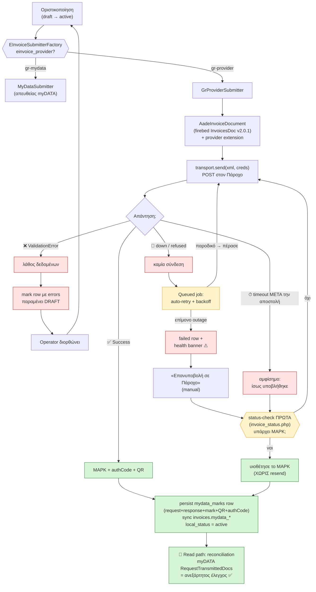
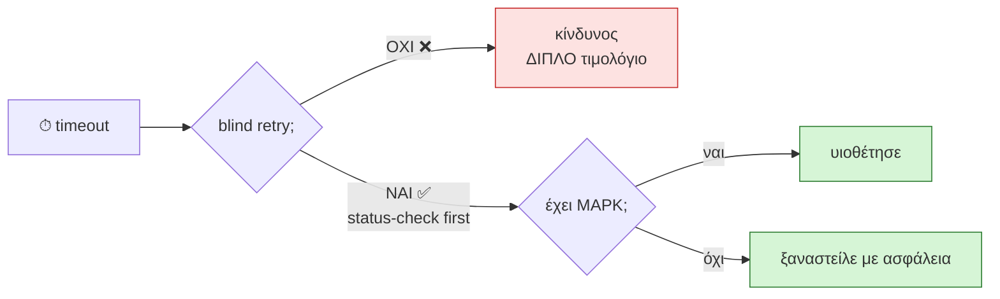
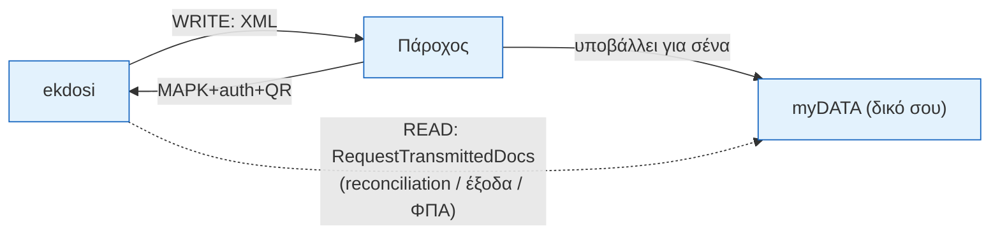

# Ροή έκδοσης μέσω Παρόχου — happy path + fallbacks

> Μονοσέλιδη εποπτεία της ροής (implementation-plan §14). **Write = πάροχος ·
> Read = myDATA.** Renders on GitHub (Mermaid).

## 1. Κύρια ροή (με το status-check loop)

## 2. Γιατί το status-check είναι το κλειδί (το αμφίσημο timeout)

## 3. Write vs Read (το μοντέλο σε μία εικόνα)

> **Νομικό:** μετά τη «Δήλωση Αποκλειστικής Έκδοσης», ο fallback είναι
> **retry / queue / offline-mode** — **όχι** επιστροφή σε απευθείας myDATA (§14.6).
> **Offline issuance** (`transmissionFailure` 1–4) = ο θεσμοθετημένος fallback όταν
> πέφτει η σύνδεση — deferred v1.
